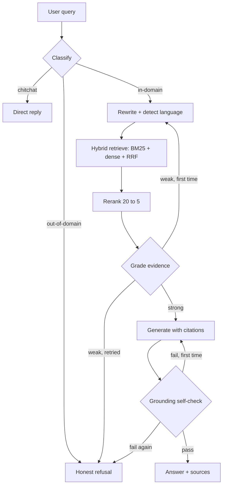

# PRD — SchemeSetu

**Bilingual RAG assistant for Indian government schemes**

| Field | Value |
|---|---|
| Version | 1.0 — approved for build |
| Owner | Varsha |
| Date | 24 Aug 2026 |
| Timeline | 8 weeks part-time (~10 hrs/week) |
| Positioning | Resume/learning project: RAG · LangChain · LangGraph · evals |

> **What is a PRD?** A Product Requirements Document defines *what* is being built, *for whom*, *what "done" means* (measurable), and *in what order* — before code is written. Sections 5, 9 and 10 are the contract: if a week's exit criteria aren't met, the scope of the next week shrinks; the deadline doesn't move.

---

## 1. Overview

SchemeSetu answers citizens' questions about Indian government schemes — *"Am I eligible for PM-Kisan?"*, *"What documents do I need for the post-matric scholarship?"* — in English and Hindi, with every answer grounded in official scheme documents and cited back to the exact source passage. When the corpus doesn't contain the answer, it says so instead of guessing.

It is deliberately built in stages: each retrieval component is first implemented **from scratch** (to understand the internals), then upgraded to the production pattern (LangChain for ingestion plumbing, LangGraph for the agent layer), with quality **measured on a frozen golden set after every stage**. The before/after numbers are the point — they are the interview story.

**Lineage:** descends from recurring SIH problem statements (multilingual citizen-service chatbots, scheme discovery assistants for portals like myScheme). Cite the specific PS you're basing it on in the README.

## 2. Problem

- India has 3,000+ central and state schemes. Eligibility rules, benefits, and document checklists are buried in PDFs and circulars written in bureaucratic language.
- Existing portals (myScheme.gov.in) support browse/filter, not conversational Q&A with citations.
- Authoritative documents are mostly English; a large share of target users query in Hindi.
- Generic chatbots hallucinate scheme rules. This is a *high-cost-of-error* domain: a wrong eligibility answer wastes a citizen's time, money and application effort — which is exactly why grounding, citations and honest refusal are first-class requirements here, and why the domain showcases RAG well.

## 3. Goals and non-goals

**Goals**

- **G1** — Grounded answers: every factual claim traceable to a cited source passage.
- **G2** — Honest refusal: out-of-corpus questions get "I don't know + here's what I can answer", not a guess.
- **G3** — Bilingual: Hindi queries perform within 10% of English on all quality metrics.
- **G4** — Measured quality: a frozen golden set and an eval harness that runs at every phase; every architectural decision justified by a number.
- **G5** — Deployed public demo + a repo that reads as production-aware (tracing, pinned deps, eval report, decision log).

**Non-goals (v1)**

- No fine-tuning of models (retrieval quality is the lever here; be ready to explain *why* in interviews).
- No accounts/auth, no application submission or form-filling on behalf of users.
- No live sync with scheme updates (manual re-ingestion is fine).
- No voice, no WhatsApp channel, no languages beyond EN+HI (all stretch goals, §12).

## 4. Users and user stories

**Personas**

- **P1 — Citizen / family helper:** asks eligibility and process questions, often in Hindi, on a phone.
- **P2 — Facilitator (CSC / e-Mitra operator, NGO volunteer):** power user, asks comparison and edge-case questions across schemes.
- **P3 — Technical evaluator (interviewer/recruiter):** honest admission — this is a portfolio project, and the person skimming the demo, README and eval numbers is a first-class user. Their journey (§6, FR-7.4) is designed, not accidental.

**User stories with acceptance criteria**

| ID | Story | Acceptance |
|---|---|---|
| U1 | As a citizen, I ask "Am I eligible for X?" | Answer states the conditions, notes which ones depend on my situation, cites source passages |
| U2 | As a citizen, I ask what documents scheme X needs | Checklist extracted from the official doc, cited |
| U3 | As a Hindi speaker, I ask in Hindi | Answer in Hindi, same sources, same accuracy bar |
| U4 | As a citizen, I ask something out of scope ("crypto tax rules?") | Polite refusal + examples of what it can answer; no fabrication |
| U5 | As a facilitator, I ask "difference between scheme X and Y for a BPL widow?" | Multi-document synthesis with per-claim citations |
| U6 | As an evaluator, I open the README/demo | Architecture diagram, metrics table with before/after per phase, live link, ≤2 min to first impression |

## 5. Success metrics

All quality metrics measured on the **frozen golden set v1** (§9). Record the Phase-1 naive baseline for every metric — improvement deltas are the story.

| Metric | Target | Notes |
|---|---|---|
| Retrieval hit-rate@5 | ≥ 0.85 | gold source doc appears in top-5 retrieved |
| MRR@10 | report | rank quality of first correct source |
| Faithfulness (RAGAS or judge) | ≥ 0.90 | claims supported by retrieved context |
| Answer relevance | ≥ 0.85 | answers the actual question |
| Trap refusal rate | ≥ 0.90 | out-of-corpus traps correctly refused |
| False-refusal rate | ≤ 0.10 | answerable questions wrongly refused |
| Hindi parity | within 10% of EN | on all metrics above |
| Latency | p50 ≤ 3 s, p95 ≤ 8 s | end-to-end, deployed |
| Cost | ≤ ₹1 / query average | log per-query token cost |

**Learning metrics (this is a learning project — treat these as requirements):** one decision-log entry per phase (what was tried, numbers, why chosen); you can re-implement Phase-1 naive RAG from memory; you can explain every dependency's job in one sentence.

## 6. Functional requirements

Priorities: **P0** must-have · **P1** should-have · **P2** nice-to-have. Phases are build order (§10).

**Phase 0 — Corpus & golden set**

- FR-0.1 (P0) Collect 150–300 scheme documents (PDF/HTML) from myScheme + 2–3 ministries (suggested: agriculture, scholarships/education, women & child development). EN required, HI where available.
- FR-0.2 (P0) Document registry with metadata: scheme name, ministry, language, source URL, retrieval date.
- FR-0.3 (P0) Golden set v1 written **before any retrieval tuning** and then frozen (composition in §9). Separate 10-question dev set for tuning.

**Phase 1 — Naive RAG from scratch (no frameworks)**

- FR-1.1 (P0) Fixed-size chunking, BGE-M3 embeddings, cosine similarity in NumPy, top-k → prompt → answer. Purpose: internals. This code stays in the repo (`/naive`) — it's the "what does LangChain actually do for you?" answer.
- FR-1.2 (P0) First full eval run = recorded baseline.

**Phase 2 — Ingestion & chunking (LangChain enters)**

- FR-2.1 (P0) Robust parsing (Docling or PyMuPDF; OCR only if a critical doc demands it).
- FR-2.2 (P0) Compare 3 chunking strategies (fixed / recursive / structure-aware by headings & tables) — decision made by eval numbers, recorded in decision log.

**Phase 3 — Hybrid retrieval**

- FR-3.1 (P0) Qdrant as vector store (local Docker; free cloud tier for deploy).
- FR-3.2 (P0) BM25 (rank_bm25, in-process — you can see the algorithm) + dense, fused with Reciprocal Rank Fusion.
- FR-3.3 (P1) Metadata filtering (ministry, language).

**Phase 4 — Reranking & citations**

- FR-4.1 (P0) Cross-encoder reranker (bge-reranker-v2-m3), top-20 → top-5.
- FR-4.2 (P0) Citations: answer references source passages; UI can show the passage.
- FR-4.3 (P1) Refuse when top reranked score is below a tuned threshold.

**Phase 5 — Agent layer (LangGraph)**

- FR-5.1 (P0) Graph: classify query (chitchat / in-domain / out-of-domain) → rewrite + language detect → retrieve → **grade retrieved evidence** (CRAG-lite) → generate with citations → **grounding self-check** → answer or honest refusal. One retry loop max on weak retrieval, one on failed grounding.
- FR-5.2 (P1) Checkpointed conversation state (LangGraph persistence) for follow-up questions.
- FR-5.3 (P2) Clarifying-question node for ambiguous queries.

**Phase 6 — Multilingual**

- FR-6.1 (P0) A/B on the Hindi golden subset: BGE-M3 cross-lingual retrieval vs translate-then-retrieve. Ship the winner; record both scores.
- FR-6.2 (P0) Answer in the query's language.

**Phase 7 — App, deploy, observability**

- FR-7.1 (P0) Streamlit chat UI with citation panel; "show trace" view of the agent path taken.
- FR-7.2 (P0) Deploy: Hugging Face Spaces + Qdrant Cloud free tier.
- FR-7.3 (P0) Tracing with Langfuse (OSS) or LangSmith free tier.
- FR-7.4 (P1) `/evals` page or README section rendering the metrics table (persona P3's landing spot).

**Phase 8 — Hardening & portfolio**

- FR-8.1 (P0) Eval report (phase-by-phase table), README with architecture diagram, decision log, pinned dependencies.
- FR-8.2 (P1) 3-minute demo video; resume bullets with **real measured numbers**.

## 7. Agent design (LangGraph)

**State schema (minimum):** `query, language, rewritten_query, retrieved_docs, evidence_grade, draft_answer, grounding_verdict, retry_counts, final_answer, citations`.

Interview framing: this is a *state machine with cycles*, which is precisely what LangGraph adds over a LangChain chain (loops, branching, checkpointed state, human-in-the-loop hooks). Be able to say that sentence with a straight face and draw this graph on a whiteboard.

## 8. Tech stack

| Component | Choice | Why (interview answer) | Free path |
|---|---|---|---|
| Language/API | Python 3.11+, FastAPI (optional behind Streamlit) | ecosystem default | — |
| Parsing | Docling or PyMuPDF | tables & layout in govt PDFs | OSS |
| Embeddings | BGE-M3 (sentence-transformers) | one model, multilingual EN+HI, local = free | local CPU |
| Vector DB | Qdrant | hybrid-capable, production credibility, free tier | Docker / 1 GB cloud free |
| Sparse | rank_bm25 in-process | you can read the algorithm you're using | OSS |
| Fusion | RRF | simple, strong, explainable | — |
| Reranker | bge-reranker-v2-m3 | cross-encoder precision on top-20 | local CPU |
| LLM (generation) | Claude Haiku 4.5 | fast + cheap, strong grounding | Groq Llama / Gemini Flash free tiers for dev |
| LLM (judge) | Claude Sonnet | judge must be stronger than / different from generator | spot-check 20% by hand |
| Orchestration | LangChain (ingestion) + LangGraph (agent) | the resume keywords, used where they earn their keep | OSS |
| Evals | RAGAS + custom harness | custom harness = you understand the metrics | OSS |
| Tracing | Langfuse (OSS) or LangSmith | debugging + "observability" talking point | free tiers |
| UI / deploy | Streamlit on HF Spaces | fastest credible demo | free |

Pin every dependency (`requirements.txt` with exact versions) — LangChain/LangGraph APIs move fast and an unpinned repo that no longer runs is a dead portfolio piece.

## 9. Evaluation plan

**Golden set v1 — 55 questions, written from the documents *before* building retrieval, then frozen:**

- 20 single-document factual (eligibility, amounts, deadlines, documents required)
- 10 multi-document synthesis (comparisons, "which schemes apply to me")
- 10 Hindi (mix of the above)
- 10 out-of-corpus traps (plausible but unanswerable from the corpus)
- 5 ambiguous (correct behavior = ask a clarifying question or state assumptions)

Each item: question, ground-truth answer, gold source doc IDs. Keep a **separate 10-question dev set** for day-to-day tuning — never tune on the frozen set, or your numbers are fiction (this is data leakage; know the term).

**Cadence:** full eval run at the end of every phase; append one row per metric to `evals/results.md`. LLM-as-judge scores get 20% hand-verification; note judge/generator model separation (§8).

## 10. Milestones — 8 weeks, exit criteria are the definition of done

| Wk | Focus | Exit criteria |
|---|---|---|
| 1 | Corpus + golden set + naive RAG from scratch | 150+ docs registered; golden set v1 frozen; naive pipeline answers end-to-end; **baseline eval recorded** |
| 2 | Ingestion + chunking experiments | 3 strategies compared on dev set; winner chosen by numbers; decision log entry |
| 3 | Qdrant + hybrid (BM25 + dense + RRF) | hit-rate@5 improvement vs Wk 2 demonstrated |
| 4 | Reranker + citations | faithfulness measured; citations visible in output; low-score refusal threshold tuned |
| 5 | LangGraph agent | graph runs with retries + refusal; trap refusal ≥ 0.90 on golden traps |
| 6 | Hindi | A/B done (cross-lingual vs translate-then-retrieve); Hindi within 10% of EN |
| 7 | UI + deploy + tracing | public URL live; traces visible; latency measured on deployed app |
| 8 | Eval report, README, decision log, video | a stranger can run it from the README; metrics table complete; resume bullets drafted with real numbers |

If a week slips, cut from the *end* (P1/P2 items), never from evals — a smaller system with numbers beats a bigger one without.

## 11. Risks and mitigations

| Risk | Mitigation |
|---|---|
| Scanned/table-heavy PDFs break parsing | Curate corpus toward text-first PDFs; Docling for tables; OCR only if a critical doc demands it |
| Free-tier rate limits mid-demo | Local models for embed/rerank; cache embeddings; keep a fallback LLM provider wired |
| Golden-set leakage (tuning on it) | Frozen v1 + separate dev set; freeze date recorded in repo |
| Scope creep in the agent layer | FR-5.3 and beyond are P2; graph is capped at the §7 design for v1 |
| Hindi eval quality | Native-speaker review of the 10 Hindi items (or careful back-translation check) |
| LangChain/LangGraph API churn | Pin versions; wrap framework calls behind thin interfaces of your own |
| Burnout / placement season collides | The Wk-4 checkpoint is a shippable product (RAG + citations + evals); Wks 5–8 each add one resume line |

## 12. Deliverables, stretch goals, and the interview map

**Deliverables:** deployed demo URL · repo with README + architecture diagram · `evals/results.md` phase-by-phase table · decision log · 3-min video · resume bullets.

**Stretch (only after Wk 8):** voice input (Whisper), WhatsApp channel, one regional language, streaming responses, Qdrant-native sparse vectors replacing rank_bm25.

**Interview map — what each phase lets you defend:**

| Phase | You can now answer |
|---|---|
| 1 | What embeddings are; why cosine similarity; what vector search does; what LangChain abstracts |
| 2 | Chunking trade-offs; why parsing is the real bottleneck; recursive vs structure-aware splitting |
| 3 | Dense vs sparse retrieval; why hybrid wins; how RRF works; when metadata filters beat semantics |
| 4 | Bi-encoder vs cross-encoder; precision@k vs recall; grounding & citation strategies |
| 5 | Chains vs agents; state machines; CRAG-style self-correction; hallucination control; when *not* to use an agent |
| 6 | Multilingual embeddings vs translate-then-retrieve; tokenizer effects on Indic scripts |
| 7 | Tracing/observability; latency budgets; cost per query |
| 8 | Eval methodology; LLM-as-judge pitfalls; data leakage; why you didn't fine-tune |

**Resume bullets (templates — replace bracketed numbers with your measured ones; never ship placeholder numbers):**

- Built and deployed a bilingual (EN/HI) RAG assistant over [200+] government scheme documents; hybrid BM25+dense retrieval with cross-encoder reranking raised retrieval hit-rate@5 from [0.6X] to [0.8X] on a 55-question golden set.
- Designed a LangGraph agent (query routing, evidence grading, grounded citation generation, self-check) achieving [90%+] refusal on out-of-corpus questions at [<10%] false-refusal.
- Instrumented end-to-end evaluation (RAGAS + LLM-as-judge, 20% human-verified) and tracing (Langfuse); p50 latency [X s] at [₹X]/query.
