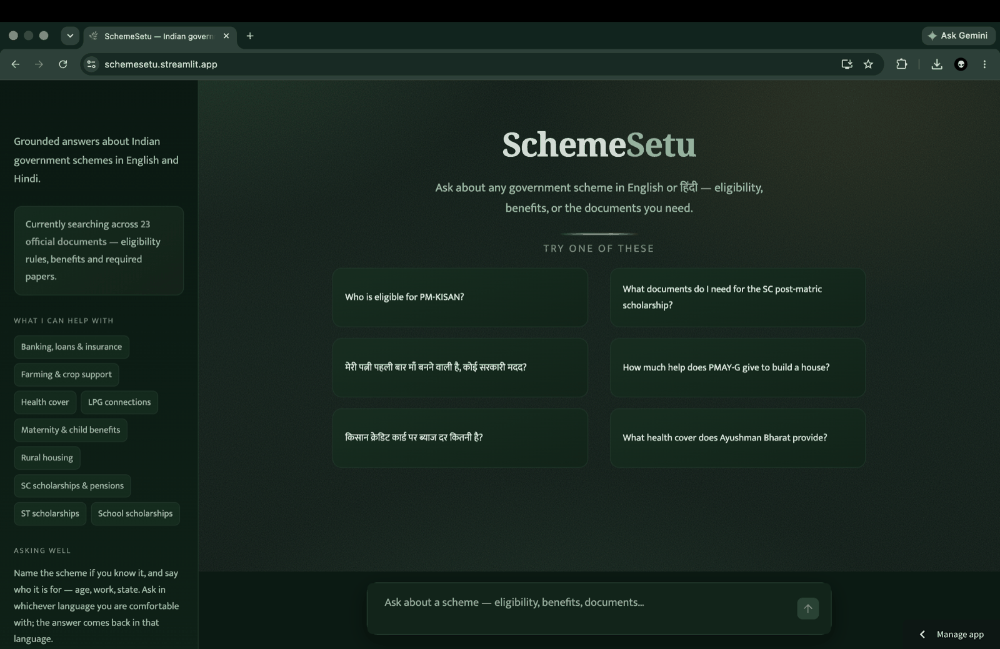
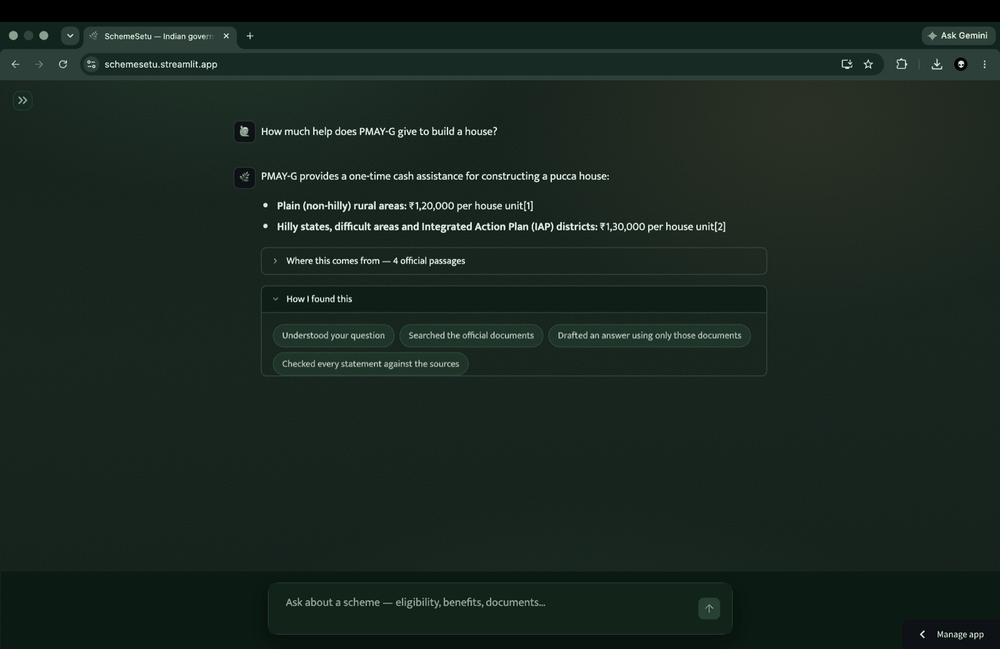
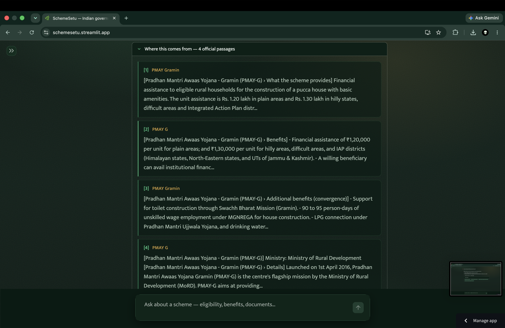
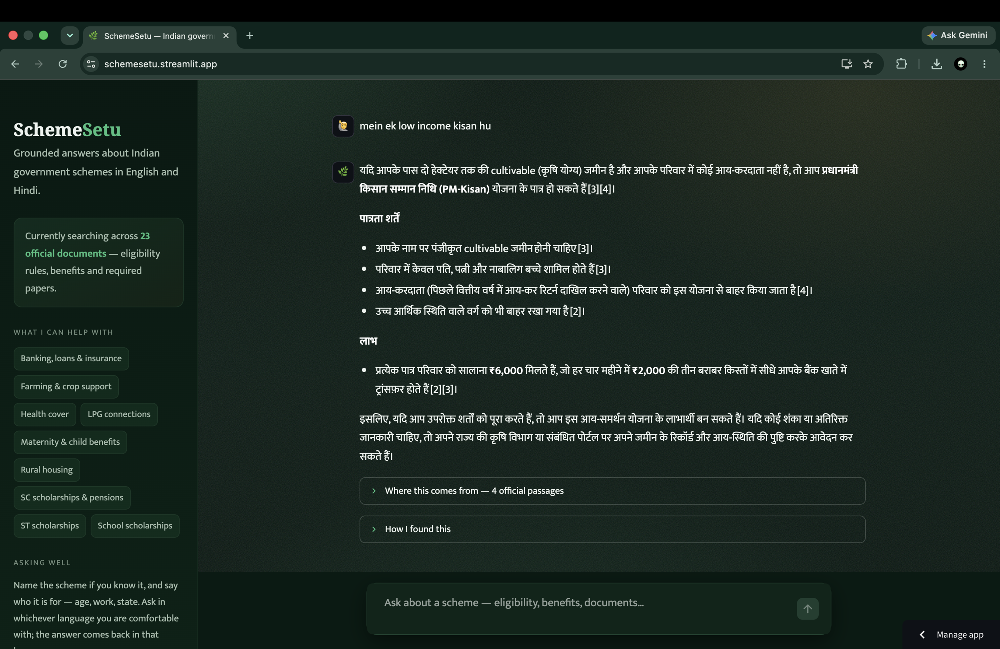
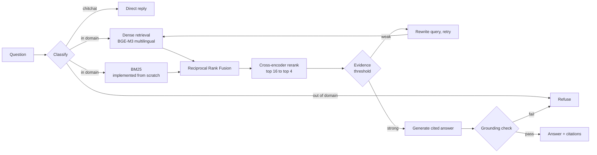

<h1 align="center">SchemeSetu</h1>

<p align="center">
  <strong>Bilingual question answering over Indian government welfare schemes —<br>
  grounded in official documents, cited to the passage, and willing to say "I don't know."</strong>
</p>

<p align="center">
  <a href="https://schemesetu.streamlit.app"><strong>Live demo →</strong></a> ·
  <a href="evals/results.md">Evaluation report</a> ·
  <a href="decisions.md">Decision log</a> ·
  <a href="PRD.md">Requirements</a>
</p>

<p align="center">
  <a href="https://github.com/varshakodi/SchemeSetu/actions/workflows/ci.yml"></a>
  
  
  
  <a href="LICENSE"></a>
</p>

---

India runs over 3,000 welfare schemes. Their eligibility rules, benefit amounts
and document checklists sit in bureaucratic circulars spread across dozens of
portals. A citizen acting on a wrong answer loses application fees and weeks of
effort — so in this domain, **an honest refusal is worth more than a plausible
answer**.

SchemeSetu answers questions in English or Hindi from a corpus of official
documents, cites the exact passage behind every claim, and declines when the
corpus cannot support an answer. Refusal is treated as a measured requirement,
not a fallback.

## What it looks like

<p align="center">
  
</p>

The interface states its own scope — 23 official documents, not "everything" —
and takes questions in either language without a mode switch.

<p align="center">
  
</p>

Every claim carries a citation marker, and the agent's path is shown in plain
language rather than as a developer trace.

<p align="center">
  
</p>

Citations open to the retrieved passages themselves, labelled by document and
section — the difference between an answer and a checkable one.

<p align="center">
  
</p>

Cross-lingual retrieval in practice. The input is romanised Hindi — *"mein ek
low income kisan hu"* — neither Devanagari nor a question. The answer returns
in Hindi with PM-KISAN's eligibility conditions and benefit structure, cited to
**English** source documents. No translation step: BGE-M3 embeds both languages
into one vector space, so Hindi queries retrieve English passages directly.

## Architecture



Two-stage retrieval: hybrid search nominates candidates for recall, a
cross-encoder re-scores them for precision. The agent is a LangGraph state
machine with three independent refusal layers — an evidence threshold, a
generator that returns `NO_ANSWER` when topically close passages lack the
answer, and a verifier that rejects answers about a different scheme than the
one asked.

Every retrieval component is implemented from scratch in [`naive/`](naive/) —
BM25 in under 100 lines, vector search in NumPy — before any framework is
introduced.

## Results

Measured on a **frozen 68-question benchmark** covering single-document facts,
multi-document synthesis, Hindi, out-of-corpus traps and underspecified
questions. The set is held out from all tuning; parameters are tuned on a
separate development set.

| Metric | Result | Target |
|---|---|---|
| Retrieval hit@5 | **0.96** | ≥ 0.85 ✓ |
| MRR@10 | **0.925** | — |
| Out-of-corpus refusal | **1.00** | ≥ 0.90 ✓ |
| False refusal | **0.08** | ≤ 0.10 ✓ |
| Answer relevance | **0.96** | ≥ 0.85 ✓ |
| Faithfulness | 0.83 | ≥ 0.90 ✗ |
| Hindi vs English parity | **+4.9%** | within 10% ✓ |
| Cost per query | **₹0** | ≤ ₹1 ✓ |
| Latency, p50 | 22 s hosted · 1.3 s local | ≤ 3 s ✗ |

Latency is bound by a shared free-tier vCPU running a 568M-parameter
cross-encoder, not by the algorithm; the same work takes 1.3 s locally.
Faithfulness is judged by a model from a different family than the generator,
pinned for the whole run so the score is one measurement rather than an average
over judges.

Selected results across build phases:

| Change | Effect |
|---|---|
| Structure-aware chunking over fixed windows | MRR 0.929 → 1.000 on dev |
| Hybrid retrieval over dense-only | hit@5 0.93 → 1.00 on dev |
| Cross-encoder reranking | MRR 0.917 → 1.000; every gold document at rank 1 |
| BGE-M3 over English-only embeddings | Hindi MRR 0.458 → 1.000, and English improved |
| Rank-fusion guard for non-discriminating retrievers | Hindi hit@5 0.91 → 1.00 |

The full phase-by-phase table is in [`evals/results.md`](evals/results.md);
every architectural choice, its alternatives and its measured evidence are
recorded in [`decisions.md`](decisions.md).

## Engineering notes

- **Rank fusion treats every input as an opinion.** BM25 scores every chunk
  identically for a Devanagari query, yet its arbitrary tie-order still earned
  fusion weight and could outrank a correct dense hit. Retrievers now vote only
  when they discriminate.
- **The evaluation set has its own test suite.** `evals/verify_golden.py`
  checks that every cited document exists, every figure in an answer appears in
  the documents it cites, every trap subject is genuinely absent from the
  corpus, and no benchmark question overlaps the tuning set.
- **Provider-agnostic LLM seam.** One interface spans Anthropic, Groq, Gemini,
  Cerebras and local Ollama, with rate-limit handling that distinguishes
  per-minute throttles from daily quotas. Switching providers is configuration.
- **Evaluation runs are resumable.** Per-question results persist as they
  complete, so a run interrupted by a free-tier quota continues rather than
  restarting.

## Stack

Python 3.11 · BGE-M3 embeddings · BGE reranker v2-m3 · LangGraph · Streamlit ·
NumPy · Groq / Gemini / Anthropic / Ollama · pytest · GitHub Actions

## Quickstart

```bash
git clone https://github.com/varshakodi/SchemeSetu.git && cd SchemeSetu
python3 -m venv .venv && source .venv/bin/activate
pip install -r requirements-dev.txt

python naive/rag.py ask "Who is eligible for PM-KISAN?"
```

The search index ships with the repository, so retrieval works immediately —
the first run downloads the embedding and reranking models (~4.6 GB, once).
The corpus itself is not committed; every source URL is in
[`data/registry.csv`](data/registry.csv). Rebuild the index only after changing
the corpus:

```bash
python ingest/parse.py        # extract text from any PDFs in data/raw
python naive/rag.py index     # rechunk and re-embed
```

`./demo.sh` runs a preflight check ([`scripts/doctor.py`](scripts/doctor.py) —
dependencies, corpus, index freshness, cached models, a live retrieval and a
live LLM call) and launches the UI.

Retrieval runs fully offline. Generation needs an LLM provider; free tiers are
supported — set the matching environment variable and
[`agent/llm.py`](agent/llm.py) picks it up.

```bash
python evals/run_eval.py         # retrieval metrics
python evals/run_agent_eval.py   # full agent, LLM-judged
pytest                           # unit tests
```

## Repository layout

```
naive/              retrieval pipeline and BM25, implemented from scratch
agent/              LangGraph state machine and the provider-agnostic LLM seam
ingest/             parsing, cleaning and chunking strategies
evals/              benchmark, dev set, harnesses, per-phase results
data/registry.csv   provenance for every corpus document
deploy/             deployment bundle and walkthrough
scripts/doctor.py   preflight diagnostics
tests/              unit tests, run in CI
docs/               screenshots used in this README
```

The corpus is not committed; it is rebuildable from the source URLs in the
registry, which also records the completeness of each captured document.

## License

[MIT](LICENSE). Corpus documents are Government of India publications.
