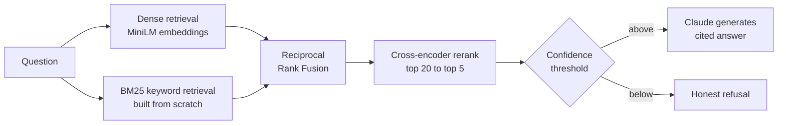

# SchemeSetu

**Ask about Indian government schemes in plain language — get answers grounded in official documents, with citations, or an honest "I don't know."**

[](https://github.com/varshakodi/SchemeSetu/actions/workflows/ci.yml)
[](https://www.python.org/)
[](LICENSE)
[](evals/results.md)

SchemeSetu is a bilingual (English/Hindi) retrieval-augmented generation (RAG)
system over official Indian government scheme documents — PM-KISAN, PMAY-G,
Ayushman Bharat, scholarships, pensions and more. It is built
**evaluation-first**: every architectural choice (chunking strategy, retrieval
mode, reranking) is decided by measured before/after numbers on a frozen
question set, and every decision is recorded with its evidence in
[`decisions.md`](decisions.md).

## Why this exists

- **3,000+ schemes, buried in PDFs.** Eligibility rules, benefit amounts and
  document checklists live in circulars written in bureaucratic language,
  scattered across dozens of portals.
- **Wrong answers cost real money.** A citizen acting on a hallucinated
  eligibility rule wastes application fees and weeks of effort. Grounding,
  per-claim citations and *measured* refusal are therefore first-class
  requirements here — not nice-to-haves.
- **Existing tools don't cite.** myScheme offers browse/filter; per-scheme
  chatbots exist (PM-KISAN's assistant, Ayushman Sarathi). SchemeSetu differs
  in three ways: citations to the exact source passage, a tracked
  honest-refusal rate on out-of-corpus questions, and a public eval report.

## How it works



Every stage is implemented **from scratch first** (see [`naive/`](naive/) —
embedding search in plain NumPy, BM25 in ~60 lines) before any framework, so
the repository doubles as a working tutorial on how RAG actually works under
the hood. Frameworks (LangChain/LangGraph) enter only where they earn their
keep — see the roadmap.

## Evaluation-driven development

Retrieval quality on the dev set (v2, 16 questions — keyword, paraphrase,
synthesis and trap types):

| Retrieval mode | hit@5 | MRR@10 |
|---|---|---|
| Dense embeddings only | 0.93 | 0.940 |
| BM25 only | 0.93 | 0.929 |
| **Hybrid — dense + BM25, RRF fusion (shipped)** | **1.00** | 0.917 |

The two retrievers fail in complementary ways — BM25 cannot find a paraphrase
with zero word overlap; embeddings blur exact names — and fusion covers both.
The full phase-by-phase table, including trap-refusal analysis, lives in
[`evals/results.md`](evals/results.md). The methodology (frozen golden set,
separate dev set, metric definitions) is documented in
[`evals/README.md`](evals/README.md).

## Quickstart

```bash
git clone https://github.com/varshakodi/SchemeSetu.git && cd SchemeSetu
python3 -m venv .venv && source .venv/bin/activate
pip install -r requirements.txt

python ingest/parse.py        # extract text from any PDFs in data/raw
python naive/rag.py index     # chunk + embed the corpus
python naive/rag.py ask "Who is eligible for PM-KISAN?"
```

Retrieval runs fully offline. Generating grounded, cited answers needs an LLM
provider — **including fully free options** (Groq, Gemini, Cerebras free
tiers, or a local Ollama): set the matching key env var and everything picks
it up automatically via the provider seam in [`agent/llm.py`](agent/llm.py)
(`LLM_PROVIDER` forces a choice; `ANTHROPIC_API_KEY` enables the PRD-default
Claude). Run the eval suite with `python evals/run_eval.py`, and the unit
tests with `pytest`.

## Roadmap

| Phase | Focus | Status |
|---|---|---|
| 1 | Corpus, provenance registry, naive RAG baseline, eval harness | ✅ |
| 2 | Chunking experiments — structure-aware chunks won | ✅ |
| 3 | Hybrid retrieval (dense + hand-built BM25 + RRF) | ✅ |
| 4 | Cross-encoder reranking, citations, refusal threshold | 🔄 |
| 5 | LangGraph agent (routing, evidence grading, self-check) | ⏳ |
| 6 | Hindi (BGE-M3 cross-lingual vs translate-then-retrieve A/B) | ⏳ |
| 7 | Deployment + tracing | ⏳ |
| 8 | Full eval report, 55-question frozen golden set | ⏳ |

Full product requirements: [`PRD.md`](PRD.md)

## Repository layout

```
PRD.md              product requirements — the contract for this build
decisions.md        every technical decision, with alternatives and evidence
naive/              from-scratch implementations: RAG pipeline, BM25
ingest/             corpus loading, cleaning, chunking strategies, PDF parsing
data/registry.csv   provenance for every corpus document (source, date, status)
evals/              golden/dev sets, metric definitions, per-phase results
tests/              unit tests (run in CI)
```

The corpus itself is not committed — it is rebuildable from the source URLs
in the registry, which also records how complete each captured document is.

## License

[MIT](LICENSE) — the corpus documents are Government of India publications
accessed from public portals; see `data/registry.csv` for per-document
provenance.
